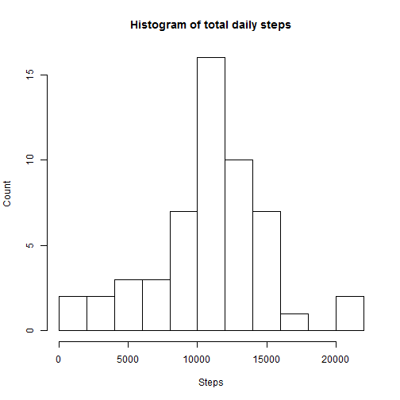
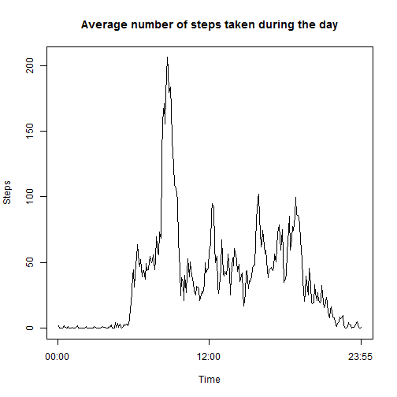
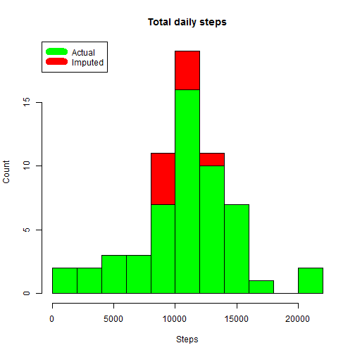
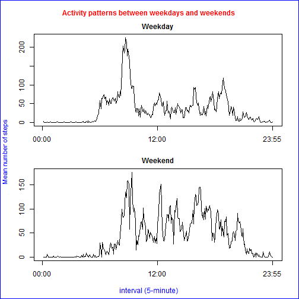

---

output: html_document
---
#"Reproducable Research: Project 1"

##Loading and preprocessing the data

Show any code that is needed to
data retreived from
https://d396qusza40orc.cloudfront.net/repdata%2Fdata%2Factivity.zip

1.      Load the data (i.e. read.csv())

```r
if(!exists("activity")){
dir<-("Y:/DataScience/Reproducable Research/Project1/")
activity<-read.csv(paste(dir,"activity.csv",sep = ""))
rm(dir)
}

if(!exists("lattice")){
library(lattice)
}
if(!exists("dplyr")){
library(dplyr)
}
```

```
## Warning: package 'dplyr' was built under R version 3.1.3
```

```
## 
## Attaching package: 'dplyr'
## 
## The following object is masked from 'package:stats':
## 
##     filter
## 
## The following objects are masked from 'package:base':
## 
##     intersect, setdiff, setequal, union
```

2.      Process/transform the data (if necessary) into a format suitable for your analysis


```r
mins  <-  as.numeric(substr(activity$interval, nchar(activity$interval)-1, nchar(activity$interval)))
hour  <- as.numeric(substr(activity$interval, 0, nchar(activity$interval)-2))
hour[is.na(hour)] <- 0
#Transform the interval column so that it has the form hh:mm.
activity$interval <- format(strptime(paste0(hour,":",mins), "%H:%M"), "%H:%M")
rm(mins)
rm(hour)

head(activity)
```

```
##   steps       date interval
## 1    NA 2012-10-01    00:00
## 2    NA 2012-10-01    00:05
## 3    NA 2012-10-01    00:10
## 4    NA 2012-10-01    00:15
## 5    NA 2012-10-01    00:20
## 6    NA 2012-10-01    00:25
```

```r
tail(activity)
```

```
##       steps       date interval
## 17563    NA 2012-11-30    23:30
## 17564    NA 2012-11-30    23:35
## 17565    NA 2012-11-30    23:40
## 17566    NA 2012-11-30    23:45
## 17567    NA 2012-11-30    23:50
## 17568    NA 2012-11-30    23:55
```

```r
summary(activity)
```

```
##      steps                date         interval        
##  Min.   :  0.00   2012-10-01:  288   Length:17568      
##  1st Qu.:  0.00   2012-10-02:  288   Class :character  
##  Median :  0.00   2012-10-03:  288   Mode  :character  
##  Mean   : 37.38   2012-10-04:  288                     
##  3rd Qu.: 12.00   2012-10-05:  288                     
##  Max.   :806.00   2012-10-06:  288                     
##  NA's   :2304     (Other)   :15840
```
##What is mean total number of steps taken per day?


1.      Calculate the total number of steps taken per day


```r
#Use aggregate function to calculate a dataframe containing the sum of total steps
#for each day.
day.summary<-aggregate(steps ~ date,data = activity,sum)
```
2.      Make a histogram of the total number of steps taken each day.


```r
#Use hist command to create histogram.
hist(day.summary$steps,breaks = 10, main = "Histogram of total daily steps",
     xlab = "Steps", ylab = "Count")
```

 

3.      Calculate and report the mean and median of the total number of steps taken per day

```r
#Calculate the mean and median number of steps per day in the trial period.
day.mean <-as.character(signif(mean(day.summary$steps), digits = 5))
day.median <-as.character(signif(median(day.summary$steps), digits = 5))
```
        The mean of the total number of steps taken per day is 10766
        The median of the total number of steps taken per day is 10765

##What is the average daily activity pattern?

1.      Make a time series plot (i.e. type = "l") of the 5-minute interval (x-axis) and the average number of steps taken, averaged across all days (y-axis)

```r
interval.summary<-aggregate(steps ~ interval,data = activity,mean)
plot.ts(interval.summary$step, type = "l",main = "Average number of steps taken during the day", xlab = "Time", ylab = "Steps",axes=FALSE)
box()
axis(2)
axis(side=1, at=c(0,12*12,12*24), labels=c("00:00","12:00","23:55"))
```

 
2.      Which 5-minute interval, on average across all the days in the dataset, contains the maximum number of steps?

```r
max_step <- subset(interval.summary, interval.summary$step==max(interval.summary$step))
```
        The time of day with the maximum average step is 08:35

##Imputing missing values

1.      Calculate and report the total number of missing values in the dataset (i.e. the total number of rows with NAs)

```r
summary(activity)
```

```
##      steps                date         interval        
##  Min.   :  0.00   2012-10-01:  288   Length:17568      
##  1st Qu.:  0.00   2012-10-02:  288   Class :character  
##  Median :  0.00   2012-10-03:  288   Mode  :character  
##  Mean   : 37.38   2012-10-04:  288                     
##  3rd Qu.: 12.00   2012-10-05:  288                     
##  Max.   :806.00   2012-10-06:  288                     
##  NA's   :2304     (Other)   :15840
```

```r
missing_rows <-length(which(is.na(activity$steps)))
```
        The total number of missing rows is 2304
        
2.      Devise a strategy for filling in all of the missing values in the dataset. The strategy does not need to be sophisticated. For example, you could use the mean/median for that day, or the mean for that 5-minute interval, etc.


```r
#I have decided to generate random numbers for the steps taken.
#As the measurement is steps per five minute period the rpois command seemed appropriate.
#It was noticed that a lot of the times zero steps were taken.
#A probability of steps being taken was calculated as well as the lambda value when steps were taken (lambda=mean of poisson distribution).
good <- complete.cases(activity)
good_activity<-activity[good,]
bad_activity<-activity[!good,]
rm(good)
good_activity$zero <- good_activity$steps>0

interval<-unique(good_activity$interval)
days_movement<-as.numeric(lapply(split(good_activity$zero, good_activity$interval), sum))
days_count<-as.numeric(lapply(split(good_activity$zero, good_activity$interval), length))
total_steps<-as.numeric(lapply(split(good_activity$steps, good_activity$interval), sum))

#calculate probability of movement
p_movement<-days_movement/days_count
#calculate the average amount of steps if movement occurs
mean_steps_move<-total_steps/days_movement

mod_act_summary<-data.frame(cbind(interval,p_movement,mean_steps_move))
names(mod_act_summary) <- c("interval","p_movement","mean_steps_move")

#Tidy
rm(p_movement)
rm(days_count)
rm(days_movement)
rm(interval)
rm(mean_steps_move)
rm(total_steps)
```
3.      Create a new dataset that is equal to the original dataset but with the missing data filled in.

```r
sim_activity<-merge(bad_activity, mod_act_summary, by.x="interval", by.y="interval")
sim_activity$mean_steps_move<-as.numeric(as.character(sim_activity$mean_steps_move))
sim_activity$p_movement<-as.numeric(as.character(sim_activity$p_movement))
#calculates the missing step values
for(i in 1:nrow(sim_activity)) {
        
        set.seed(i)
        p<-sim_activity$p_movement[i]
        x<-rbinom(n=1,size=1,prob=p)
        if(x<1){
                sim_activity$steps[i]=0
        }
        if(x>0){
                set.seed(i)
                lam<-sim_activity$mean_steps_move[i]
                sim_activity$steps[i]<-rpois(n=1,lambda=lam)
        }
}
#checks our randomly determined variables with present values
mean(sim_activity$steps)
```

```
## [1] 35.63455
```

```r
mean(good_activity$steps)
```

```
## [1] 37.3826
```

```r
#recreates modified data set
temp<-data.frame(cbind(sim_activity$steps,as.character(sim_activity$date),sim_activity$interval))
names(temp)<-c("steps","date","interval")


mod_activity <-rbind(good_activity[1:3],temp)
mod_activity$steps <-as.numeric(mod_activity$steps)
mod_activity$date<-as.Date(as.character(mod_activity$date))
```

4.      Make a histogram of the total number of steps taken each day and Calculate and report the mean and median total number of steps taken per day.
        

```r
mod.day.summary<-aggregate(steps ~ date,data = mod_activity,sum)
par(mfrow = c(1, 1)) 
hist(mod.day.summary$steps,breaks = 10,  main = "Total daily steps", col= "red", xlab = "Steps", ylab = "Count")
hist(day.summary$steps,breaks = 10, col= "green", xlab = "Steps", add=TRUE)
legend("topleft", c("Actual", "Imputed"), col=c("green", "red"), lwd=10)
```

 

```r
mod.day.mean <-as.character(signif(mean(mod.day.summary$steps), digits = 5))
mod.day.median <-as.character(signif(median(mod.day.summary$steps), digits = 5))
```
        Do these values differ from the estimates from the first part of the assignment?
        What is the impact of imputing missing data on the estimates of the total daily number of steps?
        The imputed mean of the total number of steps taken per day is 10700this compares to 10766
        The imputed median of the total number of steps taken per day is 10600this compares to 10765
        The histogram shows the imputed values are less variable than the actual values being close to the mean value.
        
##Are there differences in activity patterns between weekdays and weekends?

```r
weekend<-c("Saturday","Sunday")
mod_activity$day<-as.factor(ifelse(is.element(weekdays(as.Date(mod_activity$date)),weekend), "weekend", "weekday"))
mod.weekend.summary<-aggregate(steps ~ interval+day,data = mod_activity,mean)
#Create Panel
par(mfrow=c(2, 1), mar=c(3, 3, 2, 1), oma=c(1.5, 1, 2, 1)) 

plot.ts(mod.weekend.summary$step[1:288], type = "l",cex.main=1,main = "Weekday", xlab = "Time", ylab = "Number of Steps",axes=FALSE)
box()
axis(2)
axis(side=1, at=c(0,12*12,12*24), labels=c("00:00","12:00","23:55"))
plot.ts(mod.weekend.summary$step[289:576], type = "l",cex.main=1,main = "Weekend", xlab = "Time", ylab = "Number of Steps",axes=FALSE)
box()
axis(2)
axis(side=1, at=c(0,12*12,12*24), labels=c("00:00","12:00","23:55"))
mtext( "interval (5-minute)", side=1, outer=TRUE, col="blue", font=1 )  
mtext( "Mean number of steps", side=2, outer=TRUE, col="blue", font=1, cex=0.9 )  
mtext( "Activity patterns between weekdays and weekends", side=3, outer=TRUE, col="red", font=2 )  
box("outer", col="blue") 
```

 
The Weekend has walking more evenly spread through the day while most walking occurs durring the week between 08:00 and 09:00
